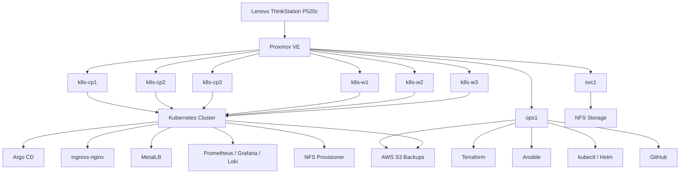

# Architecture Diagrams

## Logical Platform Diagram

```mermaid
flowchart TD
    A[Lenovo ThinkStation P520c] --> B[Proxmox VE]

    B --> CP1[k8s-cp1]
    B --> CP2[k8s-cp2]
    B --> CP3[k8s-cp3]
    B --> W1[k8s-w1]
    B --> W2[k8s-w2]
    B --> W3[k8s-w3]
    B --> OPS[ops1]
    B --> SVC[svc1]

    CP1 --> K8S[Kubernetes Cluster]
    CP2 --> K8S
    CP3 --> K8S
    W1 --> K8S
    W2 --> K8S
    W3 --> K8S

    OPS --> TF[Terraform]
    OPS --> ANS[Ansible]
    OPS --> KCTL[kubectl / Helm]

    K8S --> ARGO[Argo CD]
    K8S --> INGRESS[ingress-nginx]
    K8S --> LB[MetalLB]
    K8S --> OBS[Prometheus / Grafana / Loki]
    K8S --> STORAGE[NFS Provisioner]

    SVC --> NFS[NFS Storage]
    OPS --> GITHUB[GitHub]
    OPS --> AWS[AWS S3 Backups]
    K8S --> AWS
```
